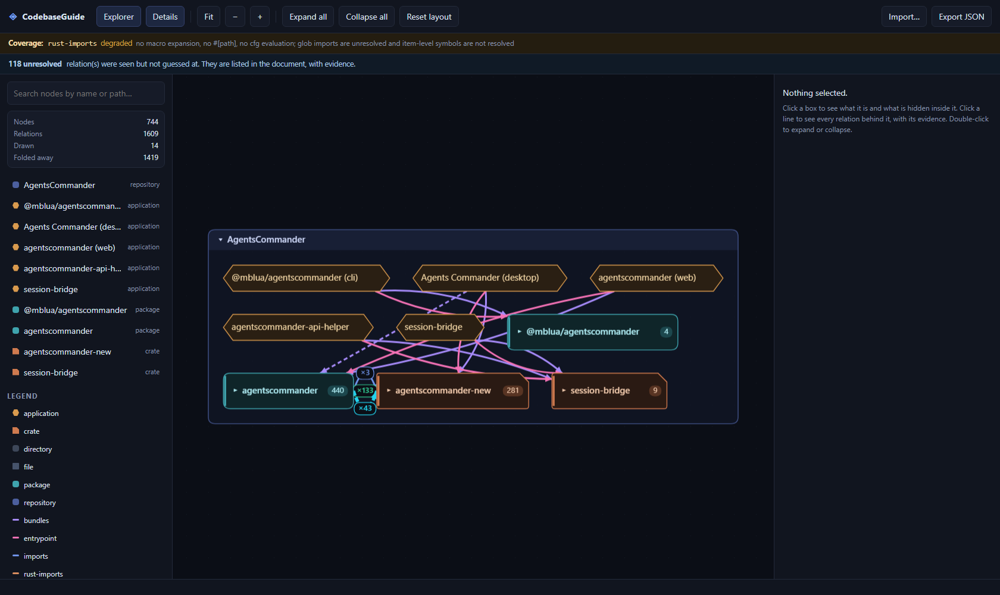

# CodebaseGuide

A local, self-contained map of a repository that you can read **without reading code**:
repositories, applications, packages and crates, directories and files as boxes; typed,
evidence-carrying relations between them; a hierarchy you expand and collapse by
double-click.

It ships with a committed map of **AgentsCommander** — 637 git-tracked files, 744 nodes,
1609 relations — produced by the extractor in this directory, not typed in by hand.



CodebaseGuide **adds files and modifies none**. It does not depend on the existing
`web/` + SQLite + WebGL + `graph-analytics` pipeline, which continues to work unchanged.
It has **zero runtime dependencies** — no graphics library, no framework.

---

## Quick start

Requires **Node ≥ 22.18** (or ≥ 23.6): the extractor runs `.ts` files directly through
Node's native type stripping, which is why the codebase is `erasableSyntaxOnly` and needs
no transpiler. Developed and verified on Node 24.13.

```powershell
cd CodebaseGuide
npm install
npm run dev            # http://localhost:5175
```

The app opens on the committed AgentsCommander map.

**No backend, no API, no outbound call, no telemetry.** The dataset is bundled into the
build as text and parsed through the same validator an imported file goes through, and
`index.html` carries a CSP with `connect-src 'self'`. Vite of course serves the files in
`dev` and `preview` — that is a static file server on your own machine, not a service the
app talks to. Once loaded, the page makes no request of anything.

### The one command that means "green"

```powershell
npm run verify   # vitest + tsc --noEmit + vite build + BOTH browser smokes
```

`npm run build` alone does not run tests, which is exactly why this command exists.

| Script | What it proves |
|---|---|
| `npm test` | 222 headless tests: contract, domain, projection, outline, controller, architecture, extractor, path confinement, privacy, dataset. |
| `npm run typecheck` | `tsc --noEmit`, strict, `noUncheckedIndexedAccess`, `erasableSyntaxOnly`. |
| `npm run verify:core` | The two above. The fast inner loop; no browser needed. |
| `npm run smoke:adapter` | The shared renderer conformance suite against the **real** Canvas2DRenderer in a **real** browser, with **real** pointer events. Needs no dataset. |
| `npm run smoke` | The acceptance smoke: the whole product against the **real committed dataset**, at 1680×1000, 1024×768 and 800×800. |
| `npm run verify` | test → typecheck → build → **adapter smoke** → **acceptance smoke**. **This is the gate.** |
| `npm run update:screenshots` | Regenerates the canonical captures in `docs/screenshots/`. **Deliberately not part of `verify`** — a gate that rewrites the documentation it is checking cannot fail cleanly. |

The browser smokes launch their own Vite on port 5175 with `--strictPort` and
`reuseExistingServer: false`, so an occupied port **fails the gate** instead of letting a
stale server answer for a tree that is not on disk. The first browser run needs Chromium:
`npx playwright install chromium`.

### Regenerating the dataset

```powershell
npm run extract:agentscommander
# = node tools/extractor/cli.ts --repo ../../repo-AgentsCommander --name AgentsCommander --out data/agentscommander.json
```

`generator.flags` records the flags that determine the **content** — not a transcript of the
command line. `--repo` and `--out` are deliberately absent: they name the operator's
filesystem, and printing an absolute path into a file that is about to be committed is a
leak, not provenance. `--stamp` is absent because it only controls `generatedAt`, which is
not part of the deterministic payload. Every flag listed, and every default it fell back to,
is hashed into `configDigest` — so the document declares the configuration that produced it
without declaring where it lives.

Two runs on the same **working tree** with the same flags are **byte-identical**.

### The tree, not just the commit

The extractor lists files with `git ls-files` — the index — and reads their **content from
the working tree**. If the tree is dirty, every `path:line` in the document describes the
files *on disk*, not the files at `source.commit`. Naming the commit anyway would be
asserting a provenance the document cannot back up, so it doesn't:

* `source.dirty: true`, and `stats.modifiedTrackedFiles` names what differs;
* the extractor prints a warning, and **the app shows a banner**.

The committed `data/agentscommander.json` was extracted from a clean checkout, so
`source.dirty` is absent and `stats.modifiedTrackedFiles` is empty. Mapping work in progress
is still supported; in that case the document and banner state it explicitly.

---

## Reading the map

* **Double-click** a box to expand or collapse it.
* **Drag** anything. A dragged node is *pinned* and auto-layout will never move it again.
  Dragging a container moves its whole subtree.
* **Right-drag anywhere** to pan the whole blueprint. The secondary button always means
  canvas movement, even over a node or an expanded container; it never moves the thing below.
* **Click a line** to see **every logical relation behind it** — both endpoints, the
  confidence, and the evidence (`path:line`). This is the thing the product exists to do.
  Parallel relations between the same pair are fanned out, so each one is separately
  visible and separately clickable, and two clicks on a line never collapse the box it
  crosses.
* **Click a box** to see what it is, its real physical path, and **which** relations are
  folded up inside it — by kind, each drillable to its logical edges and their evidence.
  Not a bare number.
* **Search** (or press `/`) to find a node; selecting a hit reveals it inside its collapsed
  ancestors.
* Everything the canvas does is also reachable from the **node list panel**, which is
  keyboard-navigable, and every selection — a node, an aggregated relation, or an internal
  bucket — is announced through `aria-live`. A canvas must not be the only way in.

| Key | |
|---|---|
| `F` | fit the map to the window |
| `+` / `-` | zoom in / out (also the toolbar's **+** and **−**) |
| `E` / `C` | expand all / collapse all |
| `R` | reset the layout you dragged |
| `S` | export JSON |
| `[` / `]` | show or hide the explorer / the detail panel |
| `/` | jump to the search box |

**Export JSON** writes the document back with your layout, expansion and viewport in it.
**Import…** opens it again — or any other CodebaseGuide document. A map you deliberately
collapsed comes back collapsed: `expanded: []` is a value, not an absence.

### It fits in a window

The two side panels are **drawers**. Above 1200px they are docked and open. Below it they
float over the canvas and start closed, so the map keeps essentially the whole width — and
they are one keystroke or one button away. (A 290px explorer plus a 380px detail panel in
an 800px window left the map 130px of canvas: a strip of pixels in which nothing could be
read, selected or believed.)

### What the map says about AgentsCommander

The first screen is the whole story: **the entire frontend reaches the entire backend
through exactly one file, over a transport that has two different backends behind it.**

Collapsed, `src/shared/ipc.ts` folds into its npm package and the Rust command modules fold
into their crate, and every command relation projects onto the same visible pair — so you
see **one line carrying ×133 `tauri-command`** and **one carrying ×43 `web-command`**. Click
either and it resolves into its individual commands, each pointing at the call site, the
`#[tauri::command]` attribute and the `generate_handler!` registration. Expand the crate and
the same relations resolve back to their specific files.

---

## The document

One versioned JSON document crosses the app boundary. The extractor writes it; the app
reads it and writes it back.

```jsonc
{
  "formatVersion": "1.0",
  "generator": { "name": "codebaseguide-extract", "version": "0.1.0",
                 "flags": ["--name","AgentsCommander","--hierarchy","logical",
                           "--invoke-facade","transport.invoke"],
                 "configDigest": "sha256:…" },
  "source": { "kind": "git-repo", "root": "AgentsCommander", "commit": "e6a0db5…" },
  "nodes": [ /* repository, applications, packages, crates, directories, files */ ],
  "edges": [ /* imports, rust-imports, bundles, entrypoint, tauri-command, web-command */ ],
  "coverage": [ /* per relation family: available | degraded | unavailable, and WHY */ ],
  "unresolved": [ /* what the extractor saw and refused to guess about, with evidence */ ],
  "view": { "expanded": ["repo:AgentsCommander"] },
  "stats": { /* every number produced by a parser */ }
}
```

### The round-trip promise

> A load→save cycle preserves **every known and unknown JSON value reachable in the
> document**, and emits **deterministic key and array order**. It does **not** preserve
> input whitespace, input key order, or numeric literal spelling.

`export()` deep-clones the raw parsed tree and **deep-merges** your view over its `view`
subtree — it does not replace it. Unknown fields inside `view`, inside each `Position` and
inside `viewport` survive, and so do positions for ids that are not in the graph. Only the
arrays whose order carries no meaning (`nodes`, `edges`, `view.expanded`) are canonicalised;
`generator.flags` is never reordered, because a flag list is not a set.

### Versioning

| Input | Behaviour |
|---|---|
| `1.0` | Accept. |
| `1.7` (unknown minor) | Accept, warn once, preserve every extension. |
| unknown entry in `requires[]` | Open **read-only**: render it, refuse to export it. |
| `2.0` (unknown major) | Reject: `IncompatibleVersionError`, naming both versions. |
| not JSON / broken graph / dangerous key | `InvalidJsonError` / `IntegrityError` / `SchemaError`. |

### An imported document is untrusted input

`__proto__`, `constructor` and `prototype` as keys are a **hard rejection** anywhere at any
depth. Non-finite numbers are rejected **document-wide**. Known path fields (`node.path`,
`Evidence.path`, `source.root`) must be POSIX-relative — no absolute, no drive letter, no
UNC, no backslash, no `..`, no NUL, no control character. There are caps on bytes, nodes,
edges, string length, JSON depth and evidence count, all checked **before** the graph is
built. The app never reads a file from disk based on document content, and there is a CSP
with `connect-src 'self'`.

**Privacy, scoped honestly.** The no-absolute-path guarantee covers *known path fields only*
(`node.path`, `Evidence.path`, `source.root`), where an absolute value is a hard rejection.
Everything else the document carries — `metadata` at any depth, values inside arrays, `label`,
`note`, `snippet`, and any preserved unknown field — is **scanned, and absolute-path-looking
values are surfaced as warnings**, with the exact location. They are never silently rewritten
and never claimed to be clean: a document that has been quietly "cleaned" cannot be trusted
either. **Snippets are off by default**; `--snippets` prints a warning that it may copy a
secret out of the repository into a document you are about to commit.

---

## Architecture, in one screen

```
contract/     imports nothing              types, validation, the raw envelope, import/export
domain/       imports contract             the Outline port, visibility/NVA, geometry, layout, commands
projection/   imports contract, domain     project() → VisibleGraph; the partition law
ports/        imports nothing              GraphRenderer, the conformance suite, edge routing
app/          imports the above            AppState, the reducer, the scene builder, the controller
ui/           imports app, ports, + inner  toolbar, node list, legend, banners, detail panel
adapters/     imports ports                FakeRenderer, Canvas2DRenderer
src/main.ts   THE COMPOSITION ROOT — the only module that wires a concrete adapter to a UI
```

`contract/`, `domain/` and `projection/` are pure TypeScript: no DOM, no graphics library,
no I/O. They are the entire understanding of the product and they run headless in Node.

**These are not conventions.** `tests/architecture/boundaries.test.ts` parses every source
with the TypeScript API and fails the build on any violating import, on any DOM reference
inside a pure layer, on any HTML sink (`innerHTML`, `document.write`, `eval`, …), and on any
network call. It also asserts that **`src/` has zero bare imports** — which is the strongest
possible form of "the graphics library is a detail": there is no graphics library.

### The four constraints, and where they are paid for

1. **A collapsed container must not hide information.** A relation whose endpoint is hidden
   is redrawn against the nearest visible ancestor, and it is still reachable — with its
   evidence — from the aggregate that represents it. `projection/project.ts`.
2. **Redrawing is deterministic and lossless.** The **partition law (I9)**: the
   `sourceEdgeIds` of every visible edge and every internal bucket form an *exact partition*
   of the logical edge ids — no duplicates, no omissions, and every id in the bucket that
   *matches* its representatives. Not a sum of counters, which can be right while omitting
   one id and double-counting another. Property-tested over 480 seeded random expand/collapse
   states, and asserted on the real dataset.
3. **The layout is the user's.** Positions survive export and re-import. Pinning is what lets
   auto-layout and manual movement coexist.
4. **The graphics library is a detail.** `ports/renderer.ts` contains no graphics type.

---

## Corrections this implementation made to `docs/ARCHITECTURE.md`

The architecture was published on a 2–1 vote. Building it settled three open questions and
turned up four errata. All of them are recorded in `docs/ARCHITECTURE.md` §16, and two have
their own ADR.

1. **The N:M outline (dissent 1).** `placementOf` + injectivity (I10) genuinely cannot place
   one package under two applications. v1 ships the honest option: **primary placement** —
   each entity is placed once, deterministically, and the *other* memberships stay `bundles`
   **edges**, which project through NVA like any other relation. The promise the test proves
   is *no membership is lost*, not *an entity appears under every app that bundles it*.
   See `docs/ADR-0001-outline-placement.md`.
2. **The deep round-trip (dissent 2).** `export()` deep-merges rather than replacing the
   `view` subtree. Covered above and pinned by `tests/contract/roundtrip.test.ts`.
3. **Verify by phases (dissent 3).** `smoke:adapter` gates the renderer with no dataset;
   `verify` runs the full acceptance smoke. Both are mandatory; neither substitutes for the
   other.
4. **The renderer gate.** §8.2 framed Cytoscape-without-compound-nodes as a spike with an
   exit criterion. The gate was decided **against** it, and the reasons are in
   `docs/ADR-0002-renderer.md`. The shared conformance suite passes against the shipped
   Canvas 2D adapter in a real browser, with real pointer events.
5. **`path: ""`.** The worked example showed it on a package without saying what made it
   legal. It is now accepted only for a root node or a node declaring
   `metadata.rootAnchor: true`, and refused anywhere else — so the validator no longer
   contradicts its own example.
6. **Non-finite numbers are rejected everywhere,** not only in `view`. `1e400` parses to
   `Infinity`, and `JSON.stringify(Infinity)` is `null`; allowing one anywhere would make the
   round-trip promise false.
7. **Edge routing is part of the port.** Four typed relations join the root package and the
   Tauri crate. Drawing them on top of each other keeps them distinct in the model and merges
   them in pixels — which is the same lie. The fan-out is defined in `ports/renderer.ts`, so
   every adapter separates them identically, and each is individually clickable.
8. **A Rust `crate` is its own kind**, not a `package` with an ecosystem tag. Two of the four
   anchors are crates, and making the reader translate is the opposite of the job. Ids keep
   the `pkg:cargo:` prefix, so a stored layout survives the distinction; the shape (a clipped
   corner) carries it as well as the colour, so it survives a colour-blind reader too.
9. **`expanded: []` is a value, not an absence.** The app used to infer "this document has no
   view" from an empty expansion, and quietly re-opened a map the user had deliberately
   collapsed and saved. `importDoc` now reports what the document *said*.
10. **`--out` and the path guards fail closed.** See *Path confinement*, above.

---

## The extractor

`tools/extractor/`. A Node/TypeScript CLI sharing `src/contract/` with the app, so its output
is validated by the **same** `validate()` the app uses on import.

```powershell
npm run extract -- --repo <path> --out data/<name>.json [--hierarchy logical|physical]
                   [--name <label>] [--invoke-facade transport.invoke] [--bare-invoke]
                   [--tsconfig <path>] [--snippets] [--stamp]
```

* **Files** — `git ls-files -z`, NUL-separated, invoked with an **argument array** (never a
  shell string). Before any file is read, its real path is asserted to be inside the repo:
  the extractor must not be a repo-escape primitive.
* **Ownership** — every `package.json` / `Cargo.toml` that declares a package is an **anchor**;
  every path belongs to its **nearest enclosing anchor**, which is how npm and Cargo resolve
  ownership themselves. Anchors are hoisted to the repository under `--hierarchy logical`
  (the default) and nest by path under `--hierarchy physical`. **Node ids are identical in
  both modes**, so a saved layout survives the switch. A pure pass-through directory like
  `crates/` never becomes a box.
* **Applications** — detected only from citable signals (`tauri.conf.json`, `index.html` +
  a Vite config, cargo bins, `package.json#bin`), each carrying the evidence that justified
  it. An application's link to code is a **relation** (`bundles`, `entrypoint`), never a
  containment level — because the Tauri app **spans two units** (an npm package and a Rust
  crate) and `session-bridge` **ships two binaries**, and a single-parent tree cannot
  express N:M. The npm bundle is anchored on `frontendDist`, which says where the output
  lands; `beforeBuildCommand` says only that *a* build happens, and guessing from it is
  not evidence.
* **TypeScript imports** — discovery with `ts.preProcessFile`, resolution with
  `ts.resolveModuleName` through the project's **own tsconfig**, so `moduleResolution:
  "bundler"` and `paths` aliases are honoured because it *is* the compiler's resolver. Asset
  imports (`./styles.css`, `../assets/icon.png`) that `tsc` cannot resolve but a bundler can
  are resolved against the git-tracked tree — the file provably exists, so it is proof, not a
  guess.
* **Rust** — a real **use-tree parser** (paths, `{}` groups, `as`, `self`, `super`, globs),
  because grouped use-trees are real: **516** of them in this repository, and a per-line regex
  mis-parses every one. `mod foo;` resolves to a file whose existence is **checked**;
  `#[cfg(test)] mod tests { … }` has no backing file and does not invent one. Globs go to
  `unresolved`. Coverage: **`degraded`, permanently and honestly** — no macro expansion, no
  `#[path]`, no `cfg` evaluation, no symbol resolution.
* **Commands** — the relation that makes the map worth reading. `tauri-command` requires
  **three** pieces of evidence (a literal call through the configured facade, a
  `#[tauri::command]` attribute, and registration in `generate_handler!`); `web-command`
  requires a literal call and a matching arm in the WebSocket router. A command bound to both
  is **two edges** — two different facts. Anything less, or a non-literal command name, goes
  to `unresolved` with evidence.

### Counts come from parsers, not from greps

Every number below is produced by an anchored pattern or a parser and pinned by a fixture
test. A raw grep is not evidence — that is not a slogan, it is why the architecture's own
first draft published three wrong numbers.

| Fact | Value |
|---|---|
| git-tracked files | **637** |
| nodes / relations | **744** / **1609** |
| nodes by kind | repository **1** · application **5** · package **2** · crate **2** · directory **97** · file **637** |
| anchors | **4** = **2 npm packages** (the root `package.json`, `npm/package.json`) + **2 Rust crates** (`src-tauri`, `crates/session-bridge`). A crate is its own kind, not a package with an ecosystem tag. |
| applications | **5** — Tauri desktop, web, two `session-bridge` binaries, the npm CLI |
| `#[tauri::command]` attributes, **anchored** | **134** (an unanchored grep finds 135 — one is inside a comment at `commands/task.rs:424`) |
| commands registered in `generate_handler!` | **134** |
| `transport.invoke` call sites | **136**, **all of them in `src/shared/ipc.ts`** |
| `tauri-command` / `web-command` relations | **133** / **43** |
| commands bound to **both** backends | **41** |
| registered but **never called** | **`get_instance_label`** — an earlier draft asserted `"unusedCommands": []`. That was never measured, and it is false. |
| web-router-only (unresolved as Tauri) | **`subscribe_session`**, **`get_pty_size`** |
| the facade's own non-literal dispatch | **1**, at `src/shared/ipc.ts:105` — `unresolved`, never a phantom edge |
| grouped Rust use-trees | **516** |
| `paths` alias usages in `src/` | **0** — recorded, not mistaken for "unsupported" |

### Path confinement

An extractor that can be talked into reading or writing outside the repository it was
pointed at is not a mapping tool, it is a file primitive. One policy, in `confine.ts`, used
by the CLI, the repository reader, the TypeScript resolver and the asset resolver:

* **Cross-drive.** On Windows `relative('C:\\repo', 'D:\\out')` returns `'D:\\out'` —
  absolute, with no `..` anywhere in it — so a "does the first segment say `..`?" check
  waves it straight through. An **absolute** result is an escape.
* **Symlinks and junctions.** A directory *inside* the working root can be a junction
  landing anywhere. `--out` is checked against the **real** path of the deepest existing
  entry, and **again immediately before the write**, because `mkdir -p` follows a junction.
  A path that cannot be resolved — a broken or inaccessible link — is **refused**: a
  security check that cannot prove containment must fail closed.
* **Escapes are reported, never clamped.** `src/../../../package.json` used to normalise to
  `package.json` — a real, tracked file — so an import pointing *outside* the repository
  became an edge to an unrelated file *inside* it. It resolves to nothing now.
* **`--tsconfig`** must be inside the repository, and TypeScript reads through a **confined
  host**: an `extends` chain reaching outside the repo fails as an ordinary tsconfig error
  rather than making the compiler read arbitrary files on our behalf.

### Error contract

Every failure is deterministic and has its own exit code: not a git repository (2), `git` not
on PATH (3), unreadable or binary file (4), **a path escaping the working root through a
symlink or junction (5)**, invalid encoding (6), invalid or missing tsconfig (7), `--out`
outside the working root by the letter of the path (8), output that fails its own validator (9).

A tracked **source** symlink that escapes the repository is *not* fatal: it is **skipped and
recorded in `unresolved`** with its evidence, because one bad link should not stop a
repository from being mapped. Exit 5 is for an **output** path that escapes — which is a
write, and must never happen.

### Tests run on fixtures, not on a neighbouring repo

CodebaseGuide's tests must pass on a clean checkout of CodebaseConstellation, where
AgentsCommander — a *different* repository — is simply absent. The extractor's tests
materialise `tools/extractor/fixtures/fixture-repo/` into a temp directory, `git init` it, and
run the real `git ls-files -z` path against it. `data/agentscommander.json` is generated once,
committed, and validated by the dataset test.

---

## Known limits

* Granularity stops at the **file**. No functions, no symbols.
* **Renames are not tracked.** A moved file is a new id and loses its stored position.
* **Rust import coverage is `degraded`,** permanently. Globs are `unresolved`.
* **Command edges are literal-only.** A name assembled at runtime — including the facade's own
  dispatch — is `unresolved` by design, not invisible.
* **External packages are not nodes**; they are counted in `stats`.
* **Multi-placement outlines are not implemented.** v1 validates injectivity and names the
  generalisation (ADR-0001).
* The default layout is a deterministic **grid pack**, not an optimised one. Expect crossings
  until you rearrange — and the arrangement you make is saved. `elkjs` behind the `AutoLayout`
  port is the deferred upgrade.
* **Privacy is guaranteed only for known path fields.** Free-form fields are scanned and warned
  about, not sanitised.
* The acceptance smoke drives the **dev server**, not the production bundle; `npm run verify`
  runs `vite build` separately, so a build failure still fails the gate, but the built artifact
  itself is not what the browser test loads.
* A pinned child dragged far outside its container grows the container symmetrically about its
  own centre; it can overlap the container's header. The user did it, and nothing is lost.
* The **layout is not persisted between sessions** — there is no storage. Your arrangement
  lives in the document: press `S`, and open the file again when you want it back.
* The browser test hooks (`globalThis.__codebaseguide`, and `conformance.html`) exist **only in
  dev and test builds**. A production bundle ships neither. They are read-only — they answer
  "where is this line drawn", which only the domain knows — and the acceptance smoke drives
  import and export through the real controls, with a real download and a real file input.
* `main.js` is ~1.2 MB (73 kB gzipped) because the whole dataset is bundled into it as text.
  That is the price of "no network call, ever".
